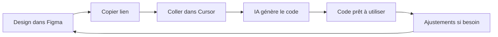

# 🎉 MCP Figma - Intégration Complète

> Le plugin MCP Figma est maintenant configuré et prêt à l'emploi !

---

## ✅ Ce qui a été fait

### 1. Vérification de la connexion MCP

✅ **Connexion active** avec votre compte Figma :

- Email : `abdenacer.maredj@theultimateclosers.com`
- Le MCP Figma communique correctement avec Cursor

### 2. Documentation complète créée

#### 📘 `.cursor/rules/figma_design_system.md`

**Règles techniques pour l'IA Cursor**

Contient :

- 🎨 Tous les tokens (couleurs, typo, spacing, shadows)
- 🧩 Structure des composants UI
- 🏗️ Architecture des sections (Hero, Mission, etc.)
- 🎭 Définitions des animations
- 📐 Breakpoints responsive
- 🔄 Workflow Figma → Code
- 📝 Conventions de nommage

**Utilité :** L'IA Cursor utilise ce document pour générer du code parfaitement aligné avec votre design system.

#### 📗 `figma-export/GUIDE-MCP-FIGMA.md`

**Guide pratique pour vous**

Contient :

- 🚀 Étapes d'utilisation du MCP
- 💡 Exemples pratiques (Hero, Cards, etc.)
- 🔥 Astuces pro
- 🎨 Workflow complet Design → Code
- 🛠️ Commandes utiles
- ⚠️ Troubleshooting

**Utilité :** Votre manuel d'utilisation pour travailler efficacement avec Figma + Cursor.

### 3. Fichiers existants (déjà présents)

- ✅ `design-tokens.json` - Tokens Figma compatibles
- ✅ `components-structure.json` - Structure des composants
- ✅ `GUIDE-IMPORT-FIGMA.md` - Import manuel dans Figma
- ✅ `color-palette.css` - Palette de couleurs
- ✅ `color-swatches.html` - Visualisation couleurs

---

## 🎯 Comment utiliser maintenant

### Méthode Simple (Recommandée)

1. **Ouvrez Figma Desktop**
2. **Créez votre design** en utilisant les tokens du projet
3. **Copiez le lien** de votre composant/section
4. **Dites à Cursor** :
   ```
   "Génère le code de ce design Figma : [votre lien]"
   ```
5. **✨ Magie !** Le code React + TypeScript + TailwindCSS est généré

### Workflow Complet



---

## 📚 Prochaines étapes

### 1. Setup Figma (15 min)

- [ ] Installez les fonts (Playfair Display + Inter)
- [ ] Créez un fichier Figma "The Ultimate Closers"
- [ ] Importez les tokens :
  - **Option A :** Plugin "Tokens Studio" + `design-tokens.json`
  - **Option B :** Création manuelle (suivre `GUIDE-IMPORT-FIGMA.md`)

### 2. Créez vos premiers composants (30 min)

- [ ] Button (6 variants)
- [ ] Card
- [ ] Badge

### 3. Testez le MCP (5 min)

- [ ] Lancez le plugin "Cursor Talk To Figma" dans Figma
- [ ] Créez un simple Button
- [ ] Demandez à Cursor de générer le code
- [ ] Vérifiez que ça fonctionne ✅

### 4. Créez les sections principales (2-3h)

- [ ] Hero
- [ ] Mission
- [ ] Services
- [ ] AI Section
- [ ] Results
- [ ] Testimonials
- [ ] CTA
- [ ] Header
- [ ] Footer

---

## 🔥 Commandes rapides

### Dans Cursor, vous pouvez maintenant dire :

**Exploration :**

```
"Montre-moi la structure de ce fichier Figma"
"Liste tous les composants de cette page"
```

**Génération :**

```
"Génère le composant Hero depuis ce design : [lien Figma]"
"Convertis cette section en React + TailwindCSS"
"Crée le code TypeScript pour ce bouton"
```

**Comparaison :**

```
"Compare mon Hero.tsx avec le design Figma : [lien]"
"Quelles différences entre le code et le design ?"
```

**Validation :**

```
"Screenshot de ce composant Figma : [lien]"
"Montre-moi visuellement ce design"
```

---

## 🎨 Design Tokens Disponibles

### Couleurs

- **Primary** : #0D4D44 (Vert Malachite)
- **Secondary** : #E9C46A (Or/Doré)
- **Accent** : #A855F7 (Violet IA)
- **Background** : #F5F0E8 (Beige clair)

### Typographie

- **Headings** : Playfair Display (72px, 48px, 36px, 24px)
- **Body** : Inter (20px, 18px, 16px, 14px, 12px)

### Spacing

Base : 4px, 8px, 12px, 16px, 24px, 32px, 48px, 64px, 96px

### Border Radius

sm: 4px, md: 8px, lg: 12px, xl: 16px, 2xl: 24px, full: 9999px

### Animations

- fade-in (0.6s)
- fade-in-scale (0.5s)
- glow-pulse (2s infinite)
- float (3s infinite)
- particle-float (8s infinite)

---

## 💡 Astuces

### Pour de meilleurs résultats :

1. **Nommez clairement** vos layers dans Figma

   - ✅ `Hero/Title`, `Button/Primary`
   - ❌ `Frame 123`, `Rectangle 5`

2. **Utilisez Auto Layout** partout

   - L'IA génère du Flexbox parfait

3. **Créez des Components avec Variants**

   - Variants Figma → Variants CVA dans le code

4. **Utilisez les Color/Text Styles**

   - Mappage automatique aux tokens Tailwind

5. **Ajoutez des annotations**
   - Notes dans Figma → Instructions pour l'IA

---

## 🆘 Besoin d'aide ?

### Documentation

- 📘 [Règles Design System](.cursor/rules/figma_design_system.md)
- 📗 [Guide MCP Figma](GUIDE-MCP-FIGMA.md)
- 📙 [Guide Import Figma](GUIDE-IMPORT-FIGMA.md)
- 📕 [Template Manuel](TEMPLATE-FIGMA-MANUEL.md)

### Fichiers

- 🎨 [Design Tokens JSON](design-tokens.json)
- 🧩 [Structure Composants](components-structure.json)
- 🌈 [Palette Couleurs](color-palette.css)
- 👁️ [Visualisation](color-swatches.html)

### Code Source

- ⚙️ [Tailwind Config](../apps/web/tailwind.config.ts)
- 🎨 [CSS Variables](../apps/web/src/app/globals.css)
- 🧩 [Composants UI](../apps/web/src/components/ui/)

---

## 🚀 C'est parti !

Vous avez maintenant tout ce qu'il faut pour :

1. ✨ Designer rapidement dans Figma
2. 🔗 Copier un lien
3. 💬 Demander à Cursor
4. ✅ Obtenir du code parfait
5. 🔄 Itérer en quelques secondes

**Design to Code = 10x plus rapide ! ⚡**

---

**Bon coding !** 🎉

_Setup complet effectué le ${new Date().toLocaleDateString('fr-FR')}_  
_The Ultimate Closers - Closing éthique & IA consciente_

